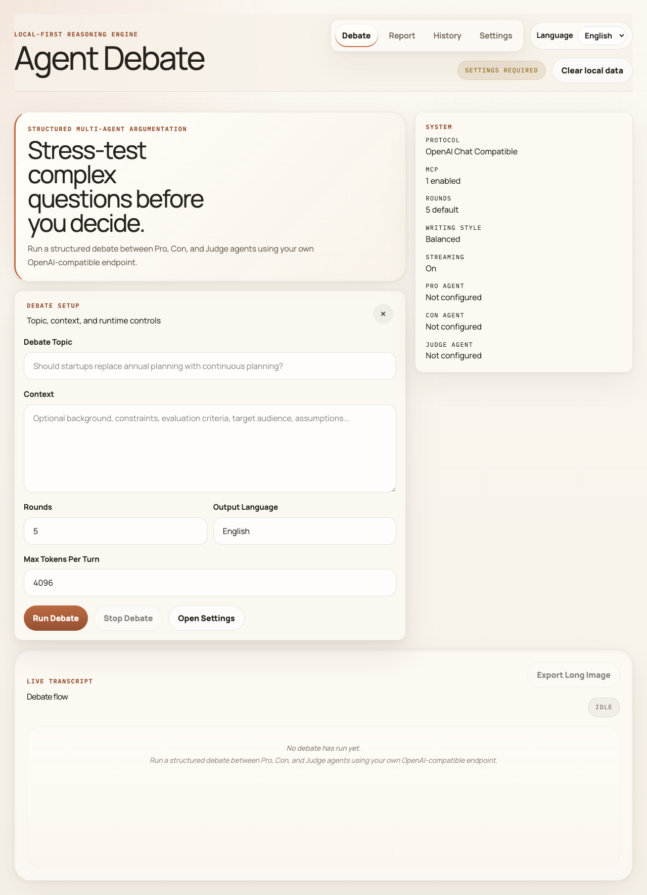
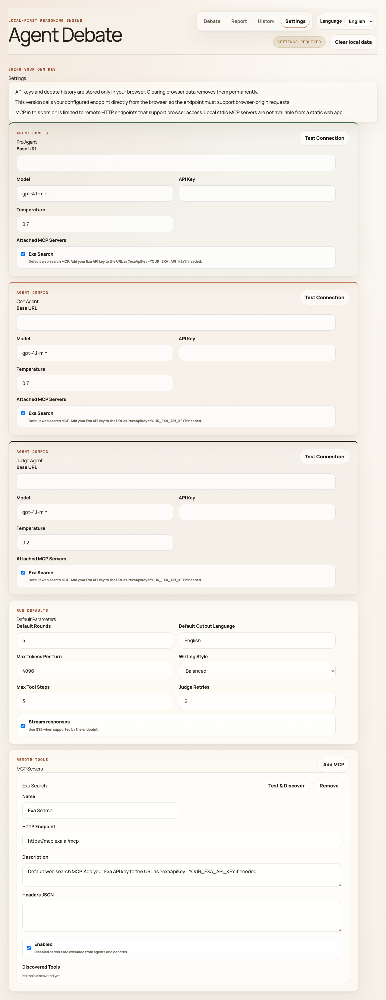

[中文文档](./README.zh-CN.md) | English

# Agent Debate

[](https://vercel.com/new/clone?repository-url=https://github.com/zhangtyzzz/agent-debate)

**Run a structured debate between Pro, Con, and Judge AI agents on any complex topic — powered by your own OpenAI-compatible API.**

`Agent Debate` is a local-first React app that orchestrates multi-round debates with streaming transcript, reasoning visibility, MCP tool support, and a judge who delivers a verdict and synthesis article.



---

## Quick Start

### 1. Install & Run

```bash
git clone https://github.com/zhangtyzzz/agent-debate.git
cd agent-debate
npm install
npm run dev
```

Open [http://localhost:4173](http://localhost:4173) in your browser.

### 2. Configure Agents

The only thing you need is an **OpenAI-compatible API endpoint**. Go to the **Settings** tab and fill in three fields for each agent (Pro, Con, Judge):

| Field    | Example                                  | Notes                                  |
| -------- | ---------------------------------------- | -------------------------------------- |
| Base URL | `https://api.openai.com/v1`              | Any OpenAI Chat Completions–compatible endpoint |
| Model    | `gpt-4.1-mini`                           | The model name your endpoint expects   |
| API Key  | `sk-...`                                 | Stored only in your browser's local storage |

All three agents can share the same endpoint and key, or you can mix different providers (OpenAI, DeepSeek, Ollama, local vLLM, etc.). Temperature is optional — the default works fine.



> **That's it.** No server-side env vars, no `.env` file, no database. Everything is configured in the browser and stored in local storage.

### 3. Run a Debate

1. Switch to the **Debate** tab
2. Enter a topic, e.g. *"Should startups replace annual planning with continuous planning?"*
3. Optionally add background context, adjust rounds (1–10), or change the output language
4. Click **Run Debate**

The Pro and Con agents will argue in real time. After all rounds, the Judge delivers a verdict and writes a synthesis article.

### 4. View Results

- **Transcript** — Watch the debate unfold live with streaming text, reasoning chains, and tool calls
- **Report tab** — See the structured verdict, key arguments, disagreements, and synthesis article
- **Export** — Download as PNG long image, Markdown file, or copy to clipboard

### 5. Optional: Add MCP Tools

Give agents access to web search or other tools via [MCP servers](https://modelcontextprotocol.io/):

1. Go to **Settings → MCP Servers**
2. Add a server URL (e.g., `https://mcp.exa.ai/mcp`)
3. Click **Test & Discover** to see available tools
4. Under each agent, check which MCP servers it should use

An Exa web search server is pre-configured by default.

---

## Highlights

- Chat-style transcript instead of split-screen debate UI
- Independent model config for `Pro`, `Con`, and `Judge`
- Structured multi-round debate orchestration
- Streaming text, reasoning, and tool activity in the transcript
- MCP tool discovery and per-agent tool attachment
- Judge verdict plus a final synthesis article
- Local browser history and transcript export (PNG / Markdown)
- Built-in Chinese and English UI
- Step-level rerun without restarting the whole debate
- Static frontend deployable to Vercel / Cloudflare Pages
- Optional MCP proxy included for Vercel and Cloudflare Pages

## Stack

- React 19, Vite 7, TailwindCSS v4
- AI SDK + OpenAI-compatible providers
- MCP via `@ai-sdk/mcp`
- Vercel Analytics
- Node built-in test runner

## Project Layout

```text
.
├── api/
│   └── mcp.js                  # Vercel MCP proxy entry
├── functions/
│   └── api/mcp.js              # Cloudflare Pages Functions MCP proxy entry
├── src/
│   ├── App.jsx                 # Main app shell (state + routing)
│   ├── core.js                 # Shared defaults and helpers
│   ├── i18n.js                 # Localization (zh-CN, en)
│   ├── components/
│   │   ├── TranscriptEntry.jsx # Debate message bubble
│   │   ├── ReportPanel.jsx     # Judge verdict + report view
│   │   ├── HistoryPanel.jsx    # Debate history list
│   │   ├── SettingsPanel.jsx   # Agent/MCP/defaults config
│   │   ├── ErrorBoundary.jsx   # Render error catch + retry
│   │   ├── ui/                 # Base UI primitives
│   │   └── ai-elements/        # Chat UI components
│   ├── services/
│   │   ├── chat.js             # Model calls
│   │   ├── debate-orchestrator.js
│   │   └── mcp.js
│   ├── utils/
│   │   └── app-helpers.jsx     # Shared helper functions
│   └── server/
│       └── mcp-proxy.js        # Shared MCP proxy logic
├── tests/
├── vercel.json
└── README.md / README.zh-CN.md
```

## Local Development

```bash
npm install
npm run dev
```

Open `http://localhost:4173`.

## Validation

```bash
npm run check
```

`npm run check` runs both tests and a production build.

## Configuration Notes

- App state, debate history, and API keys are stored in browser local storage.
- Model requests are made directly from the browser to the configured OpenAI-compatible endpoint.
- Your model endpoint must allow browser-origin requests.
- MCP calls can be routed through the included `/api/mcp` endpoint when the MCP server cannot be called safely from the browser.

## What The MCP Proxy Does

The MCP proxy is optional. It exists for cases where a browser should not call the MCP server directly.

Use it when:

- the MCP server does not allow browser CORS
- the MCP server expects server-to-server forwarding
- you want the deployed app to talk to MCP through your own domain

You usually do not need it when:

- your MCP endpoint already supports browser access correctly
- you are comfortable exposing the endpoint directly to the client

How it works:

- the browser sends MCP traffic to your app at `/api/mcp`
- the proxy forwards that request to the real MCP endpoint
- response headers such as `mcp-session-id` are passed back to the browser

## Deploy to Vercel

### One-click deploy

Use the button at the top of this README after the repository is pushed to GitHub.

### Manual deploy

1. Fork or clone the repository.
2. Install dependencies:

```bash
npm install
```

3. Verify locally:

```bash
npm run check
```

4. Import the repository into Vercel.
5. Use these settings:
   - Framework preset: `Vite`
   - Build command: `npm run build`
   - Output directory: `dist`
6. Deploy.

`vercel.json` is already configured for the default static build output.

### MCP proxy on Vercel

The repository includes [`api/mcp.js`](./api/mcp.js), which forwards MCP HTTP traffic through Vercel Functions.

Typical flow:

- your frontend calls `/api/mcp?url=https://your-mcp-server.example.com/...`
- Vercel Function forwards the request upstream
- the browser receives a CORS-safe response from your own deployment

## Deploy to Cloudflare Pages

Cloudflare Pages can reuse the same frontend build and the included Pages Functions entry at [`functions/api/mcp.js`](./functions/api/mcp.js).

Suggested settings:

- Build command: `npm run build`
- Build output directory: `dist`
- Node version: `20+`

## License

MIT. See [`LICENSE`](./LICENSE).
