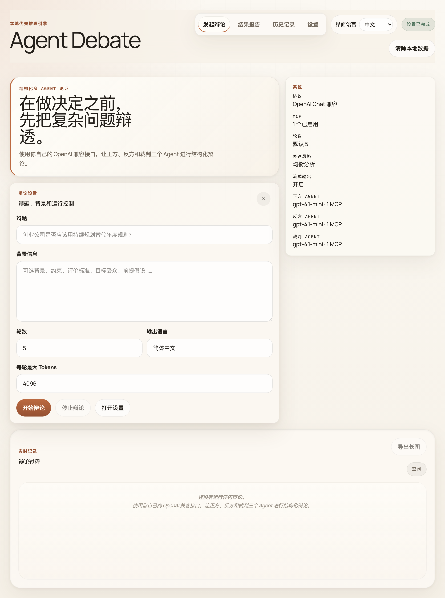
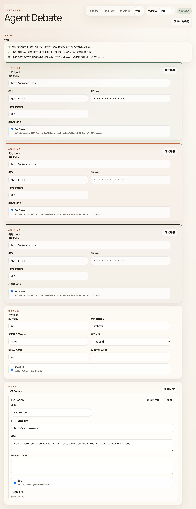

[English](./README.md) | 中文文档

# Agent Debate

[](https://vercel.com/new/clone?repository-url=https://github.com/zhangtyzzz/agent-debate)

**让正方、反方和裁判三个 AI Agent 围绕任意复杂话题展开结构化辩论 — 只需要你自己的 OpenAI 兼容接口。**

`Agent Debate` 是一个本地优先的 React 多 Agent 辩论应用。它会让正方 Agent、反方 Agent 和裁判 Agent 围绕同一议题展开多轮辩论，用聊天式 transcript 展示推理、工具调用和最终回答，并生成裁决与综合文章。



---

## 快速开始

### 1. 安装并启动

```bash
git clone https://github.com/zhangtyzzz/agent-debate.git
cd agent-debate
npm install
npm run dev
```

打开 [http://localhost:4173](http://localhost:4173)。

### 2. 配置 Agent

你只需要一个 **OpenAI 兼容的 API 接口**。切换到「设置」页面，为每个 Agent（正方、反方、裁判）填写三个字段：

| 字段     | 示例                                     | 说明                                   |
| -------- | ---------------------------------------- | -------------------------------------- |
| Base URL | `https://api.openai.com/v1`              | 任何兼容 OpenAI Chat Completions 的接口地址 |
| 模型     | `gpt-4.1-mini`                           | 你的接口所支持的模型名称               |
| API Key  | `sk-...`                                 | 仅保存在浏览器 local storage 中        |

三个 Agent 可以共用同一个接口和 Key，也可以混搭不同服务商（OpenAI、DeepSeek、Ollama、本地 vLLM 等）。Temperature 可选，默认值即可。



> **就这些。** 不需要服务端环境变量，不需要 `.env` 文件，不需要数据库。所有配置都在浏览器中完成并保存在 local storage 里。

### 3. 发起辩论

1. 切换到「发起辩论」页
2. 输入一个话题，比如 *"创业公司是否应该用持续规划替代年度规划？"*
3. 可选：添加背景信息、调整轮数（1–10）、更改输出语言
4. 点击「开始辩论」

正方和反方 Agent 会实时辩论。所有轮次结束后，裁判会给出裁决并撰写综合文章。

### 4. 查看结果

- **对话记录** — 实时观看辩论展开，包括流式文本、推理链和工具调用
- **结果报告** — 查看结构化裁决、核心论点、争议焦点和综合文章
- **导出** — 支持导出为 PNG 长图、Markdown 文件，或复制到剪贴板

### 5. 可选：添加 MCP 工具

通过 [MCP 服务](https://modelcontextprotocol.io/)给 Agent 接入联网搜索或其他工具：

1. 进入「设置 → MCP Servers」
2. 添加服务 URL（如 `https://mcp.exa.ai/mcp`）
3. 点击「测试并发现」查看可用工具
4. 在每个 Agent 配置中勾选需要使用的 MCP 服务

默认已预配置一个 Exa 联网搜索服务。

---

## 核心能力

- 聊天流式 transcript，而不是传统分栏辩论板
- `正方` / `反方` / `裁判` 独立模型配置
- 多轮结构化辩论编排
- 在 transcript 中流式展示回答、思考过程和工具活动
- MCP 工具发现与按 Agent 绑定
- 裁判胜负裁决 + 综合文章输出
- 本地历史记录与 transcript 导出（PNG / Markdown）
- 内置中英文界面
- 单步重跑，无需重启整场辩论
- 可直接部署到 Vercel / Cloudflare Pages 的静态前端
- 自带可选的 Vercel / Cloudflare Pages MCP 代理入口

## 技术栈

- React 19、Vite 7、TailwindCSS v4
- AI SDK + OpenAI-compatible provider
- `@ai-sdk/mcp`
- Vercel Analytics
- Node 内置测试运行器

## 目录结构

```text
.
├── api/
│   └── mcp.js                  # Vercel MCP 代理入口
├── functions/
│   └── api/mcp.js              # Cloudflare Pages Functions MCP 代理入口
├── src/
│   ├── App.jsx                 # 主应用界面（状态 + 路由）
│   ├── core.js                 # 默认配置与通用工具
│   ├── i18n.js                 # 国际化（zh-CN、en）
│   ├── components/
│   │   ├── TranscriptEntry.jsx # 辩论消息气泡
│   │   ├── ReportPanel.jsx     # 裁决 + 报告视图
│   │   ├── HistoryPanel.jsx    # 辩论历史列表
│   │   ├── SettingsPanel.jsx   # Agent / MCP / 默认参数配置
│   │   ├── ErrorBoundary.jsx   # 渲染错误捕获 + 重试
│   │   ├── ui/                 # 基础 UI 组件
│   │   └── ai-elements/        # 聊天 UI 组件
│   ├── services/
│   │   ├── chat.js             # 模型调用
│   │   ├── debate-orchestrator.js
│   │   └── mcp.js
│   ├── utils/
│   │   └── app-helpers.jsx     # 共享辅助函数
│   └── server/
│       └── mcp-proxy.js        # 共享 MCP 代理逻辑
├── tests/
├── vercel.json
└── README.md / README.zh-CN.md
```

## 本地开发

```bash
npm install
npm run dev
```

打开 `http://localhost:4173`。

## 发布前校验

```bash
npm run check
```

`npm run check` 会同时执行测试和生产构建。

## 配置说明

- 应用状态、辩论历史、API Key 都保存在浏览器 local storage 中。
- 模型请求默认由浏览器直接发往你配置的 OpenAI-compatible 接口。
- 因此前提是该接口允许浏览器来源访问。
- 当 MCP 服务不适合由浏览器直接访问时，可以通过项目自带的 `/api/mcp` 代理转发。

## MCP 代理到底是做什么的

这个 MCP 代理不是强制要用的，它主要解决"浏览器不适合直接访问 MCP 服务"的场景。

适合使用代理的情况：

- MCP 服务没有正确开放浏览器 CORS
- MCP 服务更适合走服务端转发，而不是前端直连
- 你希望前端始终通过自己部署的域名访问 MCP

通常不需要代理的情况：

- 你的 MCP 服务本身就支持浏览器直接访问
- 你可以接受前端直接请求该 MCP 地址

工作方式：

- 浏览器把 MCP 请求发到你部署出来的 `/api/mcp`
- 代理再把请求转发到真实 MCP 服务
- 像 `mcp-session-id` 这样的响应头会继续回传给浏览器

## 在 Vercel 上部署

### 一键部署

仓库推送到 GitHub 后，直接点击本文顶部的 Vercel 按钮即可。

### 手动部署

1. Fork 或 clone 本仓库。
2. 安装依赖：

```bash
npm install
```

3. 本地验证：

```bash
npm run check
```

4. 在 Vercel 中导入仓库。
5. 使用以下配置：
   - Framework preset: `Vite`
   - Build command: `npm run build`
   - Output directory: `dist`
6. 点击部署。

仓库已经包含 `vercel.json`，默认静态构建配置可直接使用。

### Vercel 上的 MCP 代理

项目自带 [`api/mcp.js`](./api/mcp.js)，会通过 Vercel Functions 转发 MCP HTTP 请求。

典型请求链路如下：

- 前端请求 `/api/mcp?url=https://你的-mcp-服务地址`
- Vercel Function 负责把请求转发到上游 MCP 服务
- 浏览器拿到的是你自己站点域名下返回的、可跨域消费的响应

## 在 Cloudflare Pages 上部署

Cloudflare Pages 也可以复用同一套前端构建，同时使用 [`functions/api/mcp.js`](./functions/api/mcp.js) 作为 Pages Functions 入口。

建议配置：

- Build command: `npm run build`
- Build output directory: `dist`
- Node 版本：`20+`

## 开源协议

MIT，见 [`LICENSE`](./LICENSE)。
